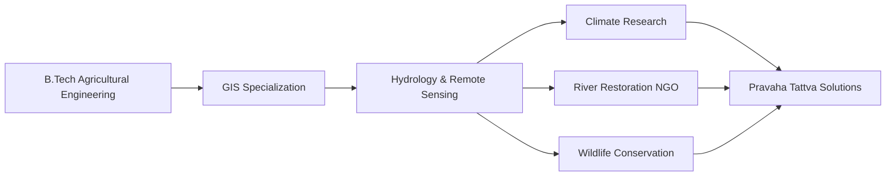

<div align="center">

<!-- Dynamic typing animation header -->
[](https://satwikkludupi.lovable.app)

<!-- Animated subtitle -->
[](https://satwikkludupi.lovable.app)


</div>

---

<div align="center">

### 🌊 *"Everything I like is either explosive, goes fast, leaks oil, or is expensive"*
#### Which explains my love for dams, bikes, and high-end sensors.

[](https://satwikkludupi.lovable.app)
[](https://preview--satwikkludupi.lovable.app/pravaha-tattva-servises)
[](https://github.com/Satwik-1234)
[](https://www.linkedin.com/in/satwik-udupi-37304a231)
[](https://www.instagram.com/007_wik)
[](mailto:satwikudupi2018@gmail.com)

</div>

---

<div align="center">

## 🔥 TECH ARSENAL 🔥

### ⚡ Languages & Core


### 🛠️ Development Environments


### 📊 Data Science & ML Stack


### 🗺️ GIS & Remote Sensing Arsenal


### 📸 Photogrammetry & UAV Processing


### 🌊 Hydraulic & Hydrological Modeling


### ⚙️ Engineering Simulation & CFD


### 🎨 Design & Visualization


</div>

---

<div align="center">

## 💥 WHAT I ACTUALLY DO 💥


</div>

### 🌊 WATER • FLOOD • RISK ENGINEERING

```yaml
Dam Breach Analysis: Koyna dam PMF/PMP scenarios → Catastrophic failure modeling
Flood Simulation: 1D/2D HEC-RAS → Manning's n calibration → Inundation mapping
Rainfall-Runoff: HEC-HMS design storms → Reservoir routing → Peak discharge
Risk Zonation: AHP multi-criteria analysis → Flood susceptibility mapping
```

**🎯 Impact:** Predictive flood models for 100+ km² floodplains | Risk maps for evacuation planning

### 🌍 LAND • EROSION • CHANGE DETECTION

```yaml
Soil Loss Mapping: RUSLE framework → Western Ghats terrain → Annual sediment yield
Erosion Dynamics: Multi-temporal Landsat analysis → Shoreline change detection
Spectral Indices: NDVI | NDWI | MNDWI | BSI | SAVI | EVI | UI → Land health monitoring
Time Series: 30+ year satellite records → Landscape evolution patterns
```

**🎯 Impact:** Erosion hotspot identification | Climate change impact assessment

### 📸 DRONES • PHOTOGRAMMETRY • 3D RECONSTRUCTION

```yaml
UAV Processing: Structure-from-Motion → Dense point clouds → Orthomosaics
Terrain Models: DSM/DEM generation → Sub-5cm resolution → Volumetric analysis
Wildlife Mapping: Camera trap data cleaning → Hotspot analysis → Species distribution
Deliverables: High-impact visual reports → Stakeholder presentations → Interactive 3D models
```

**🎯 Impact:** Precision agriculture mapping | Wildlife corridor identification | Infrastructure monitoring

---

<div align="center">

## ⚡ PERSONALITY LAYER ⚡


### *In a world full of averages, my most hated thing is "playing it safe"*

</div>

```python
class SatwikOS:
    def __init__(self):
        self.preferences = {
            "data": "chaotic, real-world, noisy",
            "solutions": "over-engineered, physics-based",
            "style": "explosive > safe",
            "hobbies": ["dams", "motorcycles", "high-end sensors"],
            "fuel": "physics equations + river hydraulics + satellite pixels"
        }
    
    def approach(self, problem):
        if problem.is_safe_and_boring():
            return "REJECT → Find the chaos"
        return self.apply_turbulence_and_gravity()
```

<div align="center">


</div>

---

<div align="center">

## 🎓 CREDENTIALS & EXPERIENCE


</div>



<div align="center">


</div>

### 🔬 Research & Projects
- **Climate Change Center** → Panchganga basin studies | Western Ghats sustainability
- **River Restoration** → Resilient River Ghod initiative | Community-based conservation
- **Engineering Lab** → FEA/CFD on agricultural machinery | Thermal & structural analysis

---

<div align="center">

## 🌍 LANGUAGES & OFF-TRACK SELF

### 💬 Spoken Languages


### 🎨 Creative Pursuits


</div>

---

<div align="center">

## 📊 GITHUB STATS


</div>

---

<div align="center">


### *"If it flows, floods, fractures, or flashes on a satellite image — I probably want to model it."*

---


**⚡ Built with chaos, precision, and way too much coffee ⚡**

[](https://satwikkludupi.lovable.app)

---


</div>
</div>
